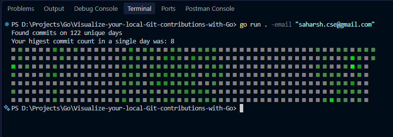

# Local Git Contributions Visualizer

A high-performance command-line interface tool built with Go. It recursively scans your local file system for Git repositories, aggregates commit history based on your author email, and renders a GitHub-style contribution heatmap directly in your terminal.



---

### Terminal Heatmap Rendering

Once compiled, the tool executes a highly optimized `Depth-First Search (DFS)` to locate `.git` directories across specified drives. It parses local Git objects directly `in memory` without relying on the external Git CLI. When executed, the tool instantly locates your cached repositories, processes 365 days of Git commit history, and uses ANSI escape codes with Unicode blocks (■) to render a precise 7x53 contribution grid.

---

### Prerequisites
Make sure you have [Go (Golang)](https://go.dev/) installed on your machine. 

## Getting Started

### Installation

1. Clone the repository:
    ```bash
    git clone https://github.com/SaharshBhatnagar/Visualize-your-local-Git-contributions-with-Go.git
    ```

2. Navigate to the project directory:

    ```bash
    cd Visualize-your-local-Git-contributions-with-Go
    ```

3. Install dependencies:

    ```bash
    go mod tidy
    ```

### Usage

1. Compile the Executable

    Compile the Go source code into a lightning-fast, standalone binary:

    ```Bash
    go build -o git-viz.exe .
    ```

2. Scan Local Directories

    Before visualizing, point the tool to the root drive or folder where your projects live. It will recursively find all Git repositories and cache their absolute paths in a hidden .local_git_repos file to ensure instant subsequent loads.

    ```bash
    .\git-viz.exe -folder "D:\Projects"
    ```

3. Visualize Contributions

    Run the compiled server tool with your Git email address to filter and map your specific commits. The tool will output your highest commit count in a single day, followed by your top 5 most active days, and print the colored heatmap grid.

    ```bash
    .\git-viz.exe -email "your.email@example.com"
    ```

> Note: If you want to visualize all commits made by any author (including open-source contributors or teammates) across your local repositories, you can disable the email filter in stats.go and run .`\git-viz.exe -email "ignore"`.

### Directory Structure

```
Visualize-your-local-Git-contributions-with-Go.git
├── main.go            
├── scan.go            
├── stats.go           
├── print.go           
├── go.mod             
└── go.sum             
```

### Additional Documentation

The directory scanner utilizes an optimized `DFS algorithm` that intentionally bypasses massive dependency folders like node_modules and vendor to minimize file system traversal latency.

**Tech Stack:** Go (Golang)

**Included packages:** github.com/go-git/go-git/v5 (for pure Go Git implementation), and standard libraries (os, fmt, flag, time, strings, path/filepath, sort).